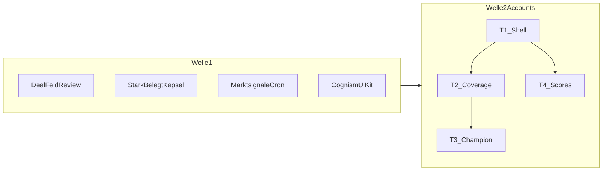

# Fixes 16.07. SaaS Brainstorming (Alex & Julo) → Abnahme schließen

Plan zum Abarbeiten der offenen Punkte aus der Mega-Note. Stand: 2026-07-28.

## Bereits abgenommen

Nicht anfassen außer nötige Anbindung:

- Benchmark-UI weg (Dealdetail)
- Stark-belegt-**Logik** (Home: ≥1 verknüpfte Referenz + Match-Score ≥ 47 %)
- Marktsignale = 1 Tabelle + Filter
- H1-Unification in Tabs
- Cognism-**Shell** (Workspace-Farben)

## Ziel

Restliche Lücken so umsetzen, dass die gesamte Note als abgenommen markierbar ist. Accounts folgt [arbeitspaket-accounts-proof-linse.md](./arbeitspaket-accounts-proof-linse.md).

---

## Todos

- [ ] Post-Analyse Review-Dialog (CRM-Felder) + Facts-Card Highlight leer/abweichend + apply via `updateDeal`
- [ ] Stark-belegt / teilweise / kein Beweis als Badge-Kapsel im Sales-Leader-Dashboard
- [ ] Feeds-abrufen-Button entfernen; Cron 6h; Enrichment/Ingest ohne Sync-Purge-UX; Timestamp behalten
- [ ] Dashboard-Beispielseite mit Cognism-Shell UI-Elementen
- [ ] Accounts T1: 3 Tabs, Signal-Strip, Buying-Center konsolidieren, tab-Remap
- [ ] Accounts T2: `deal_requirements` Migration + Coverage-Matrix im Deals-Tab
- [ ] Accounts T3 Champion-Kit + T4 echte/klare Match-Scores in Referenzen

---

## 1) Dealdetail: Nach Dokumentenanalyse Felder prüfen (2A + 2B)

**Ist:** Analyse schreibt nur `is_rfp_mode` + Snapshot/Deadlines; Stammdaten und Deal-Fakten read-only; CRM-Felder ohne Übernahme.

**Soll (fest):**

- Nach erfolgreicher Analyse: Review-Dialog (kein Auto-Overwrite in `finalizeRfpAnalysis`).
- CRM-Überlappung: Kundenname/Company, Volumen, Close/`expiry_date` (Submission).
- Pro Zeile: aktueller Wert · Vorschlag · Übernehmen / Behalten / Edit; leere und abweichende Zeilen hervorgehoben.
- Confirm → Server-Action → bestehendes `updateDeal` (Company resolve bei Name).
- Dauerhaft: [`deal-facts-card.tsx`](../app/dashboard/deals/cockpit/deal-facts-card.tsx) markiert leere Felder und Abweichung zum Snapshot + Edit-Einstieg (`EditDealDialog`).

**Dateien:** neu `lib/deals/propose-deal-fields-from-rfp.ts` + Review-UI; Trigger in Analyze-Button/Response; Copy in [`lib/copy.ts`](../lib/copy.ts). Stammdaten-only (Verfahren, Rollen, …) bleiben Snapshot-Anzeige ohne neues Schema.

---

## 2) Home: Stark belegt als Kapsel

Neben der Tone-Pill eine Coverage-Badge (`kein Beweis` / `teilweise` / `stark belegt`) aus [`build-leader-dashboard.ts`](../lib/dashboard-home/build-leader-dashboard.ts) (`≥1` Link + Score `≥ 0.47`). UI in [`sales-leader-dashboard.tsx`](../components/dashboard/sales-leader-dashboard.tsx). Subtitle behält Close-Date; Coverage nicht doppelt als Fließtext.

---

## 3) Marktsignale: Button weg + zuverlässiger/schneller

- Refresh-Button + `handleRefresh` aus [`market-signals-client.tsx`](../app/dashboard/market-signals/market-signals-client.tsx) entfernen.
- Feed nur DB-Lesen; `Zuletzt aktualisiert` bleibt (Audit/Cron).
- Kein `refreshFeeds: true` aus Produkt-UX.
- Cron auf alle 6 Stunden ([`app/api/cron/company-news/route.ts`](../app/api/cron/company-news/route.ts) / `vercel.json`); weiter inkrementell ohne Purge.
- Hot-Path Enrichment entschärfen (irrelevante Titel skippen / Backfill-Pfad stärker nutzen).

---

## 4) Cognism-Beispielseite

Neue interne Dashboard-Seite (z. B. `/dashboard/ui-kit`, Admin/Settings-Link), die Shell-Elemente auflistet: Nav/Header/H1, Buttons, Cards, Badges, Tabs, Tables, Inputs — mit `--cognism-*` Workspace-Farben. Nutzt [`lib/cognism-shell-styles.ts`](../lib/cognism-shell-styles.ts).

---

## 5) Accounts Greenfield = Proof-Linse

### T1 Shell

- 4→3 Tabs in [`company-detail-client.tsx`](../app/dashboard/accounts/company-detail-client.tsx): Überblick / Deals und Beweis / Referenzen
- Legacy `?tab=` Remap
- Signal-Strip (neuestes News + CTA Smart Match)
- Buying Center einmal im Überblick (Duplikat entfernen)

### T2 Proof-Coverage

- `deal_requirements` neu migrieren (Rollback beachten)
- Coverage-Matrix im Deals-Tab; Server via `lib/rfp-coverage` + Match-Thresholds; lazy + Cache

### T3 Champion-Kit

- Share/Portfolio aus bewiesenen Refs (`createSharedPortfolio` / PDF)

### T4 Referenzen-Scores

- Heuristik durch echte Match-Scores ersetzen oder klar als Schätzung labeln + Smart-Match-Link

---

## Abnahme-Checkliste

- [ ] Nach Analyse: Review-Dialog; CRM-Felder bestätigbar; Facts-Card markiert leer/abweichend
- [ ] Home: Coverage-Kapsel neben Tone
- [ ] Marktsignale: kein Feeds-Button; Timestamp; Cron 6h; keine Sync-Purge-UX
- [ ] Cognism-Beispielseite listet Kern-Elemente
- [ ] Accounts: 3 Tabs + Signal-Strip; Coverage; Scores; Champion-Kit

---

## Liefer-Reihenfolge

1. Welle 1: Review + Kapsel + Marktsignale + Cognism-Seite
2. Accounts T1
3. Accounts T2
4. Accounts T3 + T4
