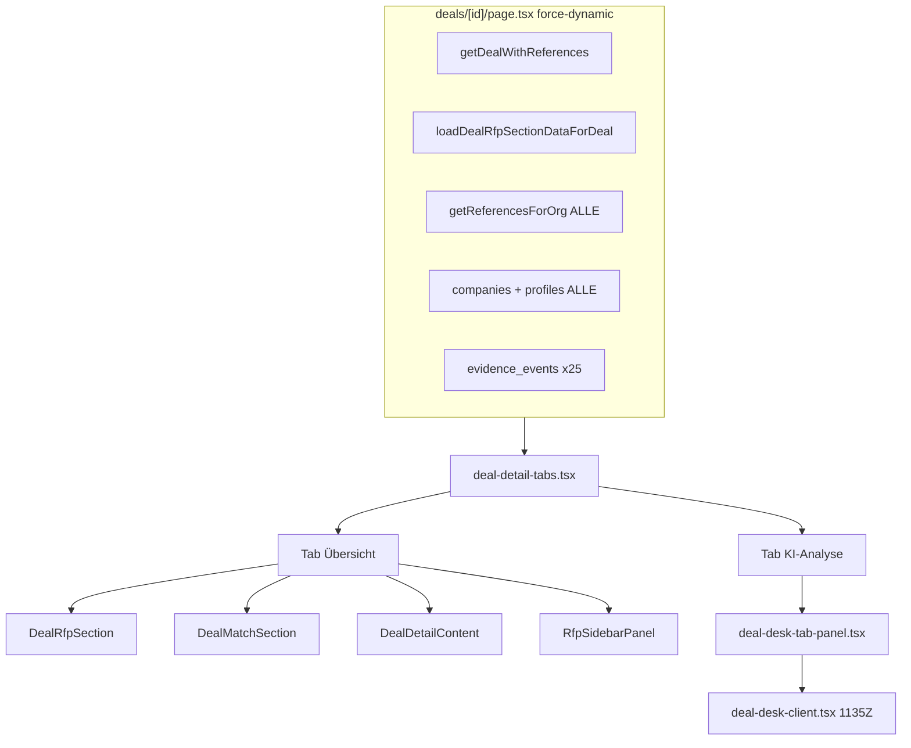
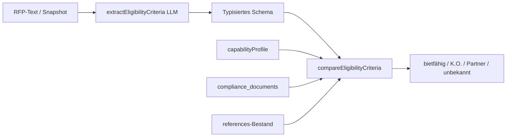
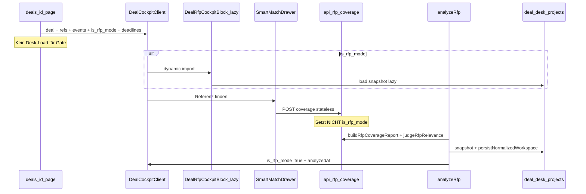

# Deal-Cockpit — Umsetzungsplan (v3.1)

**Quellen:** [docs/deals-detail-neugedacht.md](docs/deals-detail-neugedacht.md) (Revision v2 + Metriken), [docs/deals-detail-wireframe.html](docs/deals-detail-wireframe.html) (Struktur/Zustände — keine Produktions-UI)

**Leitplanken:** `lib/routes.ts`, `lib/copy.ts`, shadcn/Tailwind-Design-Tokens — keine Wireframe-Farben. Eine RFP-Pipeline (`/api/rfp/coverage` + `matchReferences`), eine Smart-Match-UI (Drawer + Vollseite).

**Status:** Phase 1 umgesetzt (2026-07-04). Dieses Dokument ist die kanonische Plan-Ablage.

---

## 0. Verifizierte Ist-Fakten (Code + DB)

| Annahme | Status |
|---------|--------|
| `deals.status` CHECK: `open`, `rfp`, `negotiation`, `won`, `lost`, `withdrawn`, `archived` | Verifiziert (`20260331172000_epic7_deals_status_events_and_requests.sql`; Legacy `rfp_phase` → `rfp`) |
| `organizations.workflow_settings` (jsonb) | Existiert → `capabilityProfile` + `icpDefinition` dort, **keine neue Org-Spalte** |
| `deal_desk_red_flags`, `deal_desk_sme_routes`, `organization_compliance_documents` | Existieren inkl. RLS (`20260630120000_deal_desk_normalized_workspace.sql`) |
| `resolveSuitabilityCriteria`, `buildExecutiveBriefingText`, `winProbabilityTone`, `nextDeadlineDate`/`daysUntil`, Risk/Red-Flag-Module | Existieren — Wiederverwendungs-Basis für Metriken, Briefing, Deadlines, Red Flags |
| `persistNormalizedWorkspace` schreibt SME + Red Flags | Implementiert in `workspace-persistence.ts` — **aber nur** von `/api/rfp/analyze`, `/api/deal-desk/analyze`, Desk-Actions aufgerufen, **nicht** direkt aus `analyze-rfp.ts` Kern. Bei Engine-Vereinheitlichung explizit sicherstellen. |
| `DESK_COVER_THRESHOLD = 0.55` vs. `MATCH_THRESHOLD = 0.35` | **Noch divergent** (`map-rfp-to-desk.ts`, `compute-delivery-win-probability.ts`) — zentralisieren (s. §8.5) |
| `deals.requirements_text` | Spalte aktiv; speist `matchReferences`, Ki-Entwurf-Kontext, Sales-Rep-Home — **Spalte bleibt**, nur UI-Card entfällt |

---

## 1. Ist-Zustand-Inventar

### 1.1 Seitenstruktur heute



| Pfad | Rolle heute | Cockpit-Schicksal |
|------|-------------|-------------------|
| [app/dashboard/deals/[id]/page.tsx](app/dashboard/deals/[id]/page.tsx) | `force-dynamic`, Upfront-Load alles | **Ändern** — nur Deal + Refs + Events + `is_rfp_mode` + Deadlines |
| [app/dashboard/deals/deal-detail-tabs.tsx](app/dashboard/deals/deal-detail-tabs.tsx) | 2 Haupttabs | **Löschen** |
| [app/dashboard/deals/deal-desk-tab-panel.tsx](app/dashboard/deals/deal-desk-tab-panel.tsx) | Wrapper Deal Desk | **Löschen** |
| [app/dashboard/deals/deal-detail-content.tsx](app/dashboard/deals/deal-detail-content.tsx) | Anforderungen-Card, Referenzen, Aktivität | **Zerlegen** — Fakten/Aktivität/Proof; **Anforderungen-Card weg, `requirements_text` bleibt** |
| [app/dashboard/deals/rfp-sidebar-panel.tsx](app/dashboard/deals/rfp-sidebar-panel.tsx) | Sidebar + OutcomeDialog | **Löschen** → Header `⋯` |
| [app/dashboard/deals/components/deal-match-section.tsx](app/dashboard/deals/components/deal-match-section.tsx) | Duplikat Smart Search | **Löschen** → Drawer |
| [app/dashboard/deals/components/deal-rfp-section.tsx](app/dashboard/deals/components/deal-rfp-section.tsx) | Duplikat RFP (`/api/rfp/analyze`) | **Löschen** |
| [app/dashboard/deal-desk/deal-desk-client.tsx](app/dashboard/deal-desk/deal-desk-client.tsx) | Monolith 1135Z | **Splitten + lazy** |
| [app/dashboard/deal-desk/components/reference-incubator-tab.tsx](app/dashboard/deal-desk/components/reference-incubator-tab.tsx) | Inkubator | **Löschen** |
| [app/dashboard/deal-desk/components/bid-next-steps-card.tsx](app/dashboard/deal-desk/components/bid-next-steps-card.tsx) | Nächste Schritte | **Löschen** |
| Smart Match: `smart-match-shell.tsx`, `smart-match-rfp.tsx`, `match-result-card.tsx`, `ki-entwurf-sheet.tsx` | Kanonische Match/RFP-UI | **Wiederverwenden** im Drawer |
| `/api/rfp/coverage` + `lib/rfp-coverage.ts` + `lib/rfp-relevance.ts` | Entkoppelte Pipeline | **Kanonische Engine** |
| `lib/deal-desk/compute-delivery-win-probability.ts` | Angebots-Reife (real) | **Behalten**, Label umbenennen |
| `lib/deal-desk/deal-desk-bid-enrichment.ts` → `resolveSuitabilityCriteria` | Freitext-Bullet-Listen fürs Briefing | **Nicht** als K.O.-Engine — nur Briefing-Kontext |
| `lib/deal-desk/workspace-persistence.ts` | Normalisierte Tabellen | **Pflicht** nach jeder Analyse |

### 1.2 De-Duplizierungs-/Ablöse-Karte

| Alt | Neu | Mechanismus |
|-----|-----|-------------|
| `DealMatchSection` | Smart-Match-Drawer | `DealSmartMatchDrawer` + `SmartMatchShell` (`embedded`, `dealId`) |
| `DealRfpSection` | Drawer RFP-Tab + konditionaler Block | `SmartMatchRfp` + lazy Snapshot |
| 3 Referenz-Flächen | `DealProofSection` | `deal_references` + Score + Feedback + Lücken |
| Tab „KI-Analyse" | `DealRfpCockpitBlock` | `next/dynamic`, nur wenn `deal.is_rfp_mode` |
| Freitext-**Card** „Anforderungen" | Entfällt als UI-Block | **`deals.requirements_text` Spalte bleibt** (Match/KI-Entwurf/Edit-Dialog) |
| `BidNextStepsCard` | — | Deadlines + Risiken |
| `ReferenceIncubatorTab` | — | Account-Gedächtnis (separat) |
| PPTX Briefing | PDF only | PPTX aus Deal-UI entfernen |
| Rechts-Sidebar | Header `⋯` | Bearbeiten, Ausgang, Referenzbedarf, Löschen |

---

## 2. Ziel-Layout (eine Seite, kein KI-Analyse-Tab)

1. **Header** — Titel, Status, Account, Volumen, Owner; rechts „Briefing erzeugen" (nur `is_rfp_mode`) + `⋯ Aktionen`
2. **Empfehlungs-Banner** — BID / NO-BID (nur RFP; degradiert bei fehlender/veralteter Analyse)
3. **Deadlines-Akkordion** — nächste Frist + Countdown; expandierbar; `＋ Termin` Popover
4. **Zweispaltig:** Deal-Fakten | Aktivität (+ Outcome via `evidence_events`)
5. **Referenzen am Deal** — eine Fläche; `＋ Referenz finden` → Drawer
6. **Konditionaler RFP-Block** (lazy) — 3 Metrik-Kacheln, Eignung/K.O., Risiken, Entwürfe, Briefing inline
7. **Standard-Deal-Hinweis** — „Als Ausschreibung bearbeiten →" wenn `!is_rfp_mode`

---

## 3. RFP-Deal-Erkennung (entschieden)

### 3.1 Kanonisches Gate — nur `deals.is_rfp_mode`

```ts
// lib/deals/is-rfp-deal.ts — für Page-Load / Sichtbarkeit
export function isRfpDeal(deal: { is_rfp_mode: boolean }): boolean {
  return deal.is_rfp_mode === true
}
```

**Wichtig:** Kein `deal_desk_projects`-Lesen für die Sichtbarkeitsentscheidung auf dem Initial-Load. Snapshot/Metriken erst im lazy `DealRfpCockpitBlock`.

### 3.2 Wann wird `is_rfp_mode` gesetzt? (und wann **nicht**)

| Trigger | Setzt `is_rfp_mode = true`? |
|---------|----------------------------|
| Nutzer: „Als Ausschreibung bearbeiten" | **Ja** (+ optional Erstanalyse starten) |
| `status` auf `rfp` (Edit-Dialog) | **Ja** (implizit mitsetzen) |
| **Persistierende** Deal-Analyse (`analyzeRfp` → Snapshot in `deal_desk_projects`) erfolgreich | **Ja** (Idempotenz) |
| Stateless Drawer: `POST /api/rfp/coverage` (Neugier-Coverage, kein Persist) | **Nein** — darf Deal nicht promoten |
| Smart Search im Drawer (`matchReferences`) | **Nein** |
| **Einmaliger Backfill** (Phase 1, gleiche Migration) | **Ja** für Bestands-Deals mit `deal_desk_projects.analysis_status = 'completed'` |

**Explizite Trennung:** Nur Code-Pfade, die `analyzeRfp` + Persistenz ausführen (Upload im RFP-Block, „Neu analysieren", Legacy-API bis Abschaltung), dürfen das Flag setzen. `/api/rfp/coverage` bleibt stateless — reine Vorschau im Drawer.

`status === 'rfp'` darf das Flag implizieren, ist aber **nicht** die billige Laufzeit-Wahrheit — die Spalte `is_rfp_mode` ist es.

### 3.3 `is_rfp_mode` zurücksetzen (manuell)

Das Flag ist **monoton** (kein automatisches Zurücksetzen) — gewollt. Für Fehlklicks:

- Im `⋯`-Menü oder Promote-Card: **„Kein Ausschreibungs-Deal"** → `is_rfp_mode = false`
- RFP-Block + Briefing-Button verschwinden; Snapshot/`deal_desk_projects` bleiben erhalten (Audit)
- Optional: Bestätigungsdialog („Analyse-Daten bleiben gespeichert")

### 3.4 Rollen-Gating (später)

RFP-Block vorerst für alle Deal-Viewer sichtbar. Capability/Rolle (Bid Manager) als bewusste Nacharbeit im Rollenmodell — nicht blockierend für Cockpit v1.

---

## 4. Datenmodell-Bedarf

### 4.1 Migrationen

| Objekt | Details |
|--------|---------|
| `deals.is_rfp_mode` | `boolean NOT NULL DEFAULT false` + **Backfill in derselben Migration** |
| `deal_deadlines` | Siehe §4.2 |
| `workflow_settings.capabilityProfile` | JSON-Merge in bestehendem `organizations.workflow_settings` (§4.3) |
| `workflow_settings.icpDefinition` | Neu — 5 Rubrik-Felder; ebenfalls per Merge |
| `analysis_snapshot.version` / `engineVersion` | Versionsfeld für Mapper + Übergangs-Degradation (§5.8) |

**Nicht in Phase 1–3:** `outcome_reason`, `decisive_reference_id` — erst mit Wissens-Erhalt-Paket; Cockpit nutzt `evidence_events`.

### 4.2 `deal_deadlines` — vollständiges Schema

```sql
-- Konzept (finale Migration in Phase 3)
deal_deadlines (
  id uuid PK,
  deal_id uuid FK → deals ON DELETE CASCADE,
  organization_id uuid FK → organizations,
  kind deal_deadline_kind,          -- enum
  label text,
  due_at timestamptz NULL,          -- exaktes Datum
  due_text text NULL,               -- „Q3 2026", „Zuschlag erwartet"
  is_approximate boolean DEFAULT false,
  source text CHECK (source IN ('rfp','manual')),
  source_key text NOT NULL,           -- stabil für RFP-Upsert; UNIQUE (deal_id, source_key) WHERE source='rfp'
  suppressed_at timestamptz NULL,   -- User-Tombstone für RFP-Termine
  pinned boolean DEFAULT false,       -- User-Edit → nicht mehr von RFP überschreiben
  created_by uuid FK → profiles ON DELETE SET NULL,
  created_at, updated_at
)
-- Index: (deal_id, due_at) WHERE suppressed_at IS NULL
-- RLS: org-scoped SELECT/INSERT/UPDATE/DELETE (Repo-Guardrail)
```

**`source_key`-Algorithmus (kritisch — keine LLM-IDs):**

Timeline-Items werden bei jeder Re-Analyse neu vom LLM erzeugt → ihre interne ID ist **nicht** stabil. `source_key` muss aus **deterministischen Attributen** abgeleitet werden:

```ts
// lib/deals/deadline-source-key.ts
function buildRfpDeadlineSourceKey(dealId: string, kind: DeadlineKind, label?: string): string {
  const base = `${dealId}:${kind}`
  // Feste RFP-Kinds (submission, questions, presentation, award_expected): nur deal_id + kind
  if (isCanonicalRfpKind(kind)) return sha256(base).slice(0, 32)
  // custom / internal_review / mehrfach möglich: normalisiertes Label mit rein
  const norm = normalizeDeadlineLabel(label ?? '')
  return sha256(`${base}:${norm}`).slice(0, 32)
}
```

- **Nicht** aus LLM-`timelineItem.id`, Array-Index oder Analyse-Lauf-ID ableiten
- Upsert: partieller Unique-Index `(deal_id, source_key) WHERE source = 'rfp'` + bedingtes `ON CONFLICT` (s. unten)
- **`organization_id`** beim Insert immer aus `deals.organization_id` ableiten (nicht aus User-Kontext allein)

**Edit / Delete vs. Upsert — re-analyse-fest (kritisch):**

Ein Edit, der `source = 'manual'` setzt, lässt die Zeile aus dem partiellen Unique-Index fallen → nächste Re-Analyse legt einen **Duplikat**-RFP-Termin an. Ein Delete per `suppressed_at` kann durch ein pauschales Upsert-`UPDATE` wieder **un-suppressed** werden.

| User-Aktion | Regel |
|-------------|--------|
| **Edit** (RFP-Termin) | `source = 'rfp'` **beibehalten**, nur `pinned = true` (+ geänderte Felder). **Nicht** auf `manual` flippen — Konfliktziel bleibt im Index. |
| **Delete** (RFP-Termin) | `suppressed_at = now()` setzen; Zeile bleibt `source = 'rfp'`. |
| **Neuer manueller Termin** (`＋ Termin`) | `source = 'manual'`, eigener `source_key` (`manual:${uuid}`) — nie vom RFP-Sync berührt. |

**RFP-Sync-Upsert (Pseudocode):**

```sql
INSERT INTO deal_deadlines (deal_id, organization_id, kind, label, due_at, due_text, is_approximate, source, source_key, ...)
VALUES (...)
ON CONFLICT (deal_id, source_key) WHERE source = 'rfp'
DO UPDATE SET
  kind = EXCLUDED.kind,
  label = EXCLUDED.label,
  due_at = EXCLUDED.due_at,
  due_text = EXCLUDED.due_text,
  is_approximate = EXCLUDED.is_approximate,
  updated_at = now()
WHERE deal_deadlines.pinned = false
  AND deal_deadlines.suppressed_at IS NULL;
-- pinned oder suppressed → DO NOTHING (kein UPDATE, suppressed_at/pinned nie anfassen)
```

**Sync-Regeln (idempotent):**

1. **Upsert per `source_key`** — Re-Analyse mit verschobenem Datum → Update **nur** wenn unpinned und nicht suppressed.
2. **User löscht RFP-Termin** → `suppressed_at`; Re-Analyse trifft ON CONFLICT, aber `WHERE`-Klausel verhindert Un-Suppress.
3. **User editiert RFP-Termin** → `pinned = true`, `source` bleibt `rfp`; Re-Analyse überschreibt nicht (DO NOTHING).
4. **Manuelle Termine** — `source = 'manual'`, außerhalb des RFP-Index; nie vom Sync angefasst.
5. **Countdown** — fixe Org-/User-Zeitzone (Off-by-one vermeiden).
6. **Fuzzy-Termine** — `due_at` null, `due_text` + `is_approximate = true`.

**Pflicht-Test (Phase 3):** „Re-Analyse nach Edit/Delete erzeugt kein Duplikat und hebt Suppression nicht auf."

### 4.3 `workflow_settings` — jsonb **mergen**, nicht überschreiben

`organizations.workflow_settings` ist ein Sammelfeld. `capabilityProfile` und `icpDefinition` müssen per **read-modify-write** bzw. `jsonb`-Merge geschrieben werden:

```ts
// lib/organizations/workflow-settings-merge.ts
export function mergeWorkflowSettings(
  current: Json,
  patch: { capabilityProfile?: ...; icpDefinition?: ... }
): Json {
  return { ...(current as object), ...patch }  // shallow merge auf Top-Level-Keys
}
```

- Server Actions: immer `SELECT workflow_settings` → merge → `UPDATE`
- **Niemals** das gesamte `workflow_settings`-Objekt durch nur `{ capabilityProfile }` ersetzen
- Tests: Schreiben von `capabilityProfile` lässt bestehende `icpDefinition` (und andere Keys) unberührt

### 4.4 Org-Fähigkeitsprofil (Settings, Admin-only)

Pfad: eigenes **„Fähigkeitsprofil"** in Settings (nicht unter Compliance vergraben).

```ts
// workflow_settings.capabilityProfile
{
  employeeCount?: number,
  annualRevenueEur?: number,
  regions?: string[],
  certifiedRoles?: Array<{ role: string; count: number }>
}
```

- Bearbeitung: **nur Admin/Owner**
- Leeres Profil → alle K.O.-Kriterien **„unbekannt"** — niemals still „bietfähig" oder „K.O."

### 4.5 ICP-Rubrik

`workflow_settings.icpDefinition` — 5 Rubrik-Felder (Branche, Volumen-Band, Region, Firmengröße Account, Segment). LLM-`icpFitLabel` aus Risk-Analyse nur ergänzender Text, nicht der Score.

---

## 5. Kritische Architektur-Punkte (vor Phasen)

### 5.1 Eignungs-/K.O.-Check = **Neubau** (Phase 5)

`resolveSuitabilityCriteria` liefert **Freitext-Bullets** („Nachweis geeigneter Referenzen…") — **nicht** quantifizierte K.O.-Schwellen (Umsatz ≥ 50 Mio, ≥ 500 MA, ≥ 10 zert. Berater). Das war im Live-Screenshot leer („—").

**Neuer Baustein** (eigenständig, gut getestet):



| Modul | Neu | Aufgabe |
|-------|-----|---------|
| `lib/deals/eligibility-criteria-schema.ts` | ja | `Dimension · Operator · Wert · Pflicht · Konfidenz` |
| `lib/deals/extract-eligibility-criteria.ts` | ja | Strukturierte LLM-Extraktion aus RFP |
| `lib/deals/compare-eligibility-criteria.ts` | ja | Konservativer Abgleich: fuzzy Freitext → Profil; **unbekannt ≠ K.O.** |
| `lib/organizations/capability-profile.ts` | ja | Lesen/Schreiben `workflow_settings` |
| `resolveSuitabilityCriteria` | bestehend | **Nur** Executive Briefing / Freitext-Kontext |

**Tests:** Fixture-RFPs mit bekannten K.O.-Kriterien; leeres Profil; Grenzfälle Konfidenz.

### 5.2 Snapshot-Staleness

Metriken (Angebots-Reife, Coverage, BID/NO-BID) stammen aus `analysis_snapshot` (Analysezeitpunkt).

- UI zeigt **„Analyse vom &lt;Datum&gt;"** + CTA **„Neu analysieren"**
- Keine still veralteten Zahlen nach Referenz-Verknüpfung/-Entfernung oder RFP-Änderung
- Banner degradiert zu **„Noch nicht berechenbar"** — kein Fake-HOLD/NO-BID ohne belastbare Daten

### 5.3 Eine Threshold-Wahrheit

Zentrale Konstante z. B. `lib/match/match-thresholds.ts`:

```ts
export const MATCH_COVERAGE_THRESHOLD = 0.35
```

Ersetzt überall: `MATCH_THRESHOLD` (`rfp-coverage.ts`), `DESK_COVER_THRESHOLD` (`map-rfp-to-desk.ts`, `compute-delivery-win-probability.ts`). Kein erneuter 0,55/0,35-Divergenz-Bug.

### 5.4 Red Flags / SME — kanonische Quelle

**Lesereihenfolge im Risiken-Panel:**

1. Normalisierte Tabellen `deal_desk_red_flags` + `deal_desk_sme_routes` (via `project_id`)
2. Fallback: Snapshot-JSON wenn Tabellen leer

**Schreibpfad sicherstellen:** Nach Engine-Vereinheitlichung muss `persistNormalizedWorkspace` (inkl. SME-Routes) **immer** nach `analyzeRfp` laufen — heute nur in API-Routes, nicht im Kern-Modul. Verifizieren in Phase 6; Integrationstest: nach Analyse sind SME-Zeilen in DB.

### 5.5 `requirements_text` — explizit

| Was | Aktion |
|-----|--------|
| DB-Spalte `deals.requirements_text` | **Behalten** |
| UI-Card „Anforderungen" in `deal-detail-content.tsx` | **Entfernen** |
| Edit-Dialog-Feld | Behalten (optional) |
| `matchReferences` / Ki-Entwurf / Smart-Match Deal-Kontext | Weiter aus Spalte + Titel/Branche |

### 5.6 Executive Briefing — PDF-Pfad (nicht nur PPTX entfernen)

**Ist:** `buildExecutiveBriefingText` (Plaintext) + `ExecutiveBriefingDialog` mit Copy + **PPTX** (`/api/deal-desk/executive-briefing-pptx`). **Keine PDF-Route** für Briefings.

**Referenz-PDF-Infra (verifiziert):** `lib/references/library/pdf/template.tsx` (+ `normalize-for-pdf.ts`, `types.ts`) existiert — Phase 7 baut darauf auf; vor Implementierung kurz Pattern lesen (Fonts, Document-Layout).

**Ziel Phase 7:**

| Baustein | Aktion |
|----------|--------|
| `lib/deal-desk/executive-briefing-pdf.tsx` | **Neu** — `@react-pdf/renderer` (Pattern wie `lib/references/library/pdf/template.tsx`) |
| `app/api/deals/[id]/executive-briefing/pdf/route.ts` | **Neu** — GET/POST, liefert `application/pdf` |
| `ExecutiveBriefingDialog` / Cockpit-Header-Button | PDF-Download + Copy; PPTX-Button **entfernen** |
| Daten | `buildExecutiveBriefingText` + Snapshot-Metriken als Input |

Akzeptanz: „Briefing erzeugen" → Vorschau-Dialog → „Als PDF" liefert downloadbare Datei.

### 5.7 Übergangs-Inkonsistenz Phase 4–6 (bewusst dokumentiert)

Zwischen Phase 4 (Metriken aus Snapshot) und Phase 6 (Engine-Vereinheitlichung mit `judgeRfpRelevance`) können Alt-Snapshots noch vom Legacy-Pfad stammen (Threshold 0,55, ohne Verdikt).

**Mitigation (in Phase 4 einbauen):**

- Snapshot-Feld `engineVersion` (ab Analyse-Lauf 2: `judgeRfpRelevance` + `MATCH_COVERAGE_THRESHOLD`)
- UI: Wenn `engineVersion < 2` oder `analyzedAt` fehlt → Metriken/Banner **degradieren** zu „Neu analysieren empfohlen" statt veralteter Zahlen
- Phase 6 setzt `engineVersion = 2` bei jedem neuen `analyzeRfp`-Lauf

Engine-Vereinheitlichung bleibt in Phase 6 (Scope); Degradation verhindert stille Regression in der Übergangszeit.

---

## 6. Phasen (klein, mergebar)

### Phase 1 — Cockpit-Shell + Thin Load

**Deliverable:** Eine Seite ohne Tabs; Header + Fakten + Aktivität; Initial-Load ohne Desk-Daten.

| Aktion | Dateien |
|--------|---------|
| Migration | `deals.is_rfp_mode` **+ Backfill in derselben Migration:** `UPDATE deals SET is_rfp_mode = true WHERE id IN (SELECT DISTINCT deal_id FROM deal_desk_projects WHERE analysis_status = 'completed')` |
| Neu | `cockpit/deal-cockpit-client.tsx`, `deal-cockpit-header.tsx`, `deal-facts-card.tsx`, `deal-activity-card.tsx`, `lib/deals/is-rfp-deal.ts` |
| Ändern | `[id]/page.tsx` — `getDealWithReferences` + Events; **kein** Desk-Load |
| Gate | RFP-Block-Slot nur wenn `deal.is_rfp_mode` |
| Entfernen | `deal-detail-tabs` aus Page; Anforderungen-Card |

**Akzeptanz:** Bestands-RFP-Deals mit abgeschlossener Analyse zeigen ab Phase 4 sofort den Block (Flag bereits true). Keine Regression Phase 4–8.

---

### Phase 2 — Referenzen am Deal + Smart-Match-Drawer

**Deliverable:** Eine Proof-Fläche; Drawer wiederverwendet Smart Match.

| Neu | `deal-proof-section.tsx`, `deal-smart-match-drawer.tsx` |
| Wiederverwenden | `SmartMatchShell`, `SmartMatchRfp`, `MatchResultCard`, `KiEntwurfSheet` |
| Löschen | `deal-match-section.tsx`, `deal-rfp-section.tsx`, `rfp-sidebar-panel.tsx`, `deal-detail-content.tsx` |
| Lazy | Org-Referenzen nur im Drawer/Link-Dialog on demand |

---

### Phase 3 — Deadlines-Akkordion

**Deliverable:** Akkordion mit Countdown; idempotenter RFP-Sync; RLS.

| Migration | `deal_deadlines` inkl. `source_key`, `suppressed_at`, `pinned`, `due_text`, `is_approximate`, RLS, Index |
| Neu | `lib/deals/deadline-source-key.ts` (deterministisch, §4.2), `lib/deals/deadlines.ts`, `deal-deadlines-card.tsx` |
| Sync | `analyze-rfp.ts` → Upsert per `source_key`; Respekt `suppressed`/`pinned` |
| Zeitzone | Countdown-Helfer mit expliziter TZ (Org `date_display_format` / Europe-Berlin Default) |

**Tests:** Re-Analyse verschiebt Datum ohne Duplikat; suppressed bleibt suppressed; pinned bleibt unverändert; **Re-Analyse nach Edit/Delete erzeugt kein Duplikat und hebt Suppression nicht auf** (§4.2).

---

### Phase 4 — Metrik-Kacheln + Empfehlungs-Banner (lazy Block-Anfang)

**Deliverable:** 3 Kacheln mit Breakdown; BID/NO-BID mit Staleness-Degradation.

| Neu | `deal-rfp-metrics-row.tsx`, `deal-rfp-recommendation-banner.tsx`, `deal-rfp-promote-card.tsx`, `deal-rfp-cockpit-block.tsx` (Skeleton) |
| Wiederverwenden | `computeDeliveryWinProbability`, `formatWinProbabilityBreakdownSummary`, `winProbabilityTone` |
| Labels | „Angebots-Reife" (nicht Win Probability); „Bietfähigkeit/Eignungs-Check"; „ICP-Fit" Rubrik-Platzhalter |
| Threshold | `MATCH_COVERAGE_THRESHOLD = 0.35` zentral einführen |
| Staleness | `analyzedAt` + `engineVersion` aus Snapshot; Degradation wenn `< 2` (§5.7) |
| Drawer | `/api/rfp/coverage` setzt **nicht** `is_rfp_mode` (§3.2) |

**Lazy:** Block per `next/dynamic`; Snapshot-Load in Suspense/Route Handler nur wenn `is_rfp_mode`.

---

### Phase 5 — Eignung & K.O.-Check (**Haupt-Neubau**)

**Deliverable:** Strukturierte Kriterien-Tabelle + Gesamtverdikt; Settings Fähigkeitsprofil.

| Neu | `eligibility-criteria-schema.ts`, `extract-eligibility-criteria.ts`, `compare-eligibility-criteria.ts`, `icp-rubric.ts`, `settings-capability-profile.tsx`, `deal-rfp-eligibility-section.tsx` |
| Settings | Admin-only; Empty-State; **`mergeWorkflowSettings`** (§4.3) |
| **Nicht** | `resolveSuitabilityCriteria` als K.O.-Engine |

**Akzeptanz:** Demo-RFP zeigt quantifizierte Schwellen; leeres Profil → alles unbekannt; K.O. nur bei explizitem ✗ mit Konfidenz.

**Tests:** Unit-Tests für Extract + Compare (Fixtures); min. 10 Randfälle.

---

### Phase 6 — Risiken + Engine-Vereinheitlichung

**Deliverable:** Red Flags + SME gruppiert; eine Coverage-Pipeline; Persistenz SME verifiziert.

| Neu | `deal-rfp-risks-section.tsx` |
| Ändern | `analyze-rfp.ts` — `buildRfpCoverageReport` + `judgeRfpRelevance`; `engineVersion = 2`; danach **`persistNormalizedWorkspace`**; **nur hier** `is_rfp_mode = true` bei Erfolg |
| Lesen | Tabellen first, Snapshot fallback |
| UI | Keine Legal/Experte-Buttons; SME nach `topic` gruppiert |
| Deprecated | `/api/rfp/analyze` als primärer Pfad für neue UI |

---

### Phase 7 — Antwort-Entwürfe + Executive Briefing (PDF)

| Neu | `deal-rfp-drafts-section.tsx`, `lib/deal-desk/executive-briefing-pdf.tsx`, `app/api/deals/[id]/executive-briefing/pdf/route.ts` |
| Wiederverwenden | `KiEntwurfSheet`, `buildExecutiveBriefingText`, `@react-pdf`-Infra aus Referenz-PDFs |
| Entfernen | PPTX-Button aus Deal-UI; Route `executive-briefing-pptx` aus Cockpit-Pfad deprecaten (Datei kann bleiben bis Cleanup) |

**Akzeptanz:** Header „Briefing erzeugen" → Dialog mit Textvorschau + funktionierendem PDF-Download.

---

### Phase 8 — Cleanup + Redirects

| Löschen | `deal-detail-tabs`, `deal-desk-tab-panel`, `deal-desk-client` (nach Extraktion), Inkubator, Next-Steps, tote Match-Clients |
| Redirect | `?tab=desk` → `deals/[id]#ausschreibung` |
| Snapshot | `version`/`engineVersion` in Mapper dokumentieren |
| Menü | „Kein Ausschreibungs-Deal" (`is_rfp_mode = false`) in ⋯-Aktionen (§3.3) |

**Hinweis:** Backfill `is_rfp_mode` erfolgt bereits in **Phase 1** — nicht erneut in Phase 8.

---

## 7. Architektur-Datenfluss (Ziel)



---

## 8. Risiken & Mitigationen

| Risiko | Mitigation |
|--------|------------|
| K.O.-Check unterschätzt | Phase 5 als eigener Neubau mit Schema + Tests; nicht an `resolveSuitabilityCriteria` koppeln |
| Thin-Load durch Desk-Gate untergraben | Nur `is_rfp_mode` auf Page; Snapshot lazy |
| Edit/Delete vs. RFP-Upsert | `source='rfp'` bei Edit beibehalten (`pinned` only); bedingtes `ON CONFLICT … WHERE pinned=false AND suppressed_at IS NULL` |
| Deadline-Duplikate (Re-Analyse) | Deterministischer `source_key` (keine LLM-IDs); siehe §4.2 |
| Backfill zu spät | **Phase 1** — gleiche Migration wie `is_rfp_mode` |
| Drawer promotet RFP-Modus | Nur `analyzeRfp` persistierend setzt Flag; `/api/rfp/coverage` stateless |
| jsonb Settings überschrieben | `mergeWorkflowSettings` read-modify-write |
| Briefing ohne PDF | Neue `@react-pdf`-Route Phase 7; PPTX allein reicht nicht |
| Alt-Snapshots Phase 4–6 | `engineVersion`-Degradation bis Phase 6 |
| Veraltete Metriken | `analyzedAt` + Degradation + „Neu analysieren" |
| Threshold-Divergenz | Eine Konstante `0.35` |
| SME-Panel leer | `persistNormalizedWorkspace` in vereinheitlichtem Analyze-Pfad + Test |
| Sensibles Capability-Profil | Admin-only; leer = unbekannt |
| `?tab=desk` Bookmarks | Redirect + Anker |
| Outcome-Reporting limitiert | `evidence_events` jetzt; DB-Spalten mit Wissens-Erhalt |
| RFP-Block Sichtbarkeit | Alle Viewer v1; Rollen-Capability später |

---

## 9. Getroffene Entscheidungen (ehem. offene Fragen)

| Frage | Entscheidung |
|-------|--------------|
| RFP-Gate | **`deals.is_rfp_mode`** kanonisch; `status='rfp'` setzt implizit mit; Snapshot nicht für Gate |
| Fähigkeitsprofil | Eigenes Settings-Panel, **Admin-only**; in `workflow_settings.capabilityProfile` |
| ICP | **`workflow_settings.icpDefinition`** neu (5 Rubrik-Felder) |
| `deal_desk_projects` | **Behalten** + Version-Feld; nicht reduzieren |
| Outcome | **`evidence_events`** jetzt; `outcome_reason`/`decisive_reference_id` erst Wissens-Erhalt |
| Rollen | RFP-Block vorerst alle Viewer; Capability-Gate später |
| Alt-Deals | **Backfill in Phase 1** (Migration mit `is_rfp_mode`) |
| `is_rfp_mode` demote | Manuell „Kein Ausschreibungs-Deal" im ⋯-Menü (§3.3) |

---

## 10. Verifikation (gesamt)

Nach jeder Phase:

- `npm run typecheck`
- `npm test` (mind. `lib/deals/*`, `deal-desk/*`, Deadline/Eligibility-Fixtures)
- Manuell: Wireframe-Szenarien strong/weak; Staleness nach Referenz-Änderung
- `rg` keine Imports gelöschter Komponenten (Phase 8)
- Keine Wireframe-Farben / hardcodierte Legacy-Pfade
